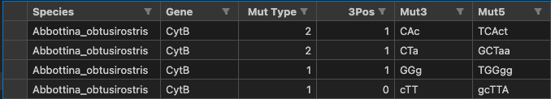

# mtdna-192component-mutspec-chordata

## Authors:
- Dmitrii Iliushchenko
- Konstantin Popadin (**Supervisor**)

## Environment

- python 3.9+

## Workflow

### 1. Download sequences from RefSeq.

Using web-site [NCBI RefSeq](https://www.ncbi.nlm.nih.gov/refseq/) with options `((complete mitochondrion RefSeq)) AND "chordates"[porgn:__txid7711] `, download GenBank file. In our case, we got 'sequence.gb'

### 2. Get genes from GenBank

To obtain all 13 mitochondrial genes use script `scripts/get_genes_from_genbank.py`. It takes GenBank file and parses the data to 13 separated fasta files with all chordates included.

### 3. Obtain expected mutspec

Obtaining the 3rd component expected mutation spectrum is carried out using the `scripts/from_gb_to_exp_subs.py` script and fasta files obtained from GenBank in 2nd step. 

At the output, we get a table in `.csv` format, you can see the description of this table below.
* Species - Name of species

* Gene - gene where substitution occurred

* Mut3 - 3 component format of substitution

* MutType- Type of substitution, where:

    a. `0` - Non Synonymous
    
    b. `1` - Synonymous
    
    c. `2` - FourFold Synonymous

    d. `-1` - StopCodon

* 3Pos - `1` if the substitution is in the third position of codon, else `0` (second or first position)

### 4. Obtain observed mutspec

Obtaining the 3rd and 5th component mutation spectrum is carried out using the `scripts/observed_mutspec.ipynb` script and `data/VertebratePolymorphisms.MutSpecDataWithNonSyn.txt` table. 
At the output, we get a table in `.csv` format, descriptions almost the same compared with previous table in 3d step

### 5. Count codons

To count how many times each of 192 codons appeared in two datasets (Expected and Observed substitutions) we used script `scripts/count_codons.ipynb`. After counting we merged two DF and saved this to `data/counted_codons_cytb.csv`. Table contains information about Species, Gene, type of codons (Expected or Observed) and **192** unique codons with their numbers.
